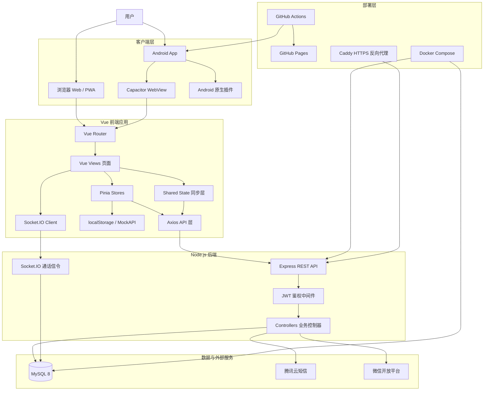
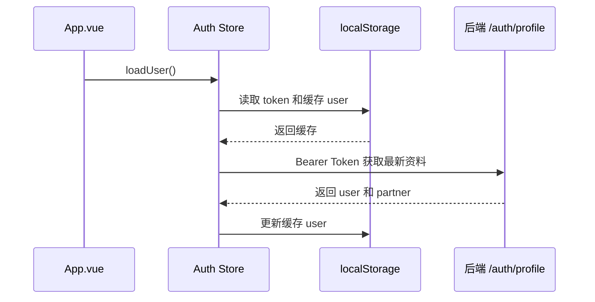
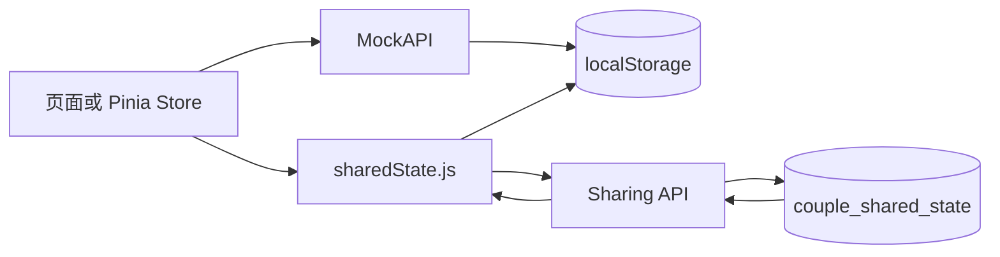
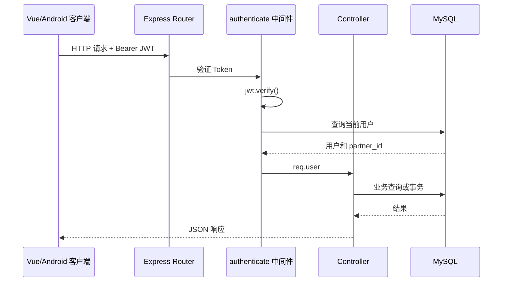
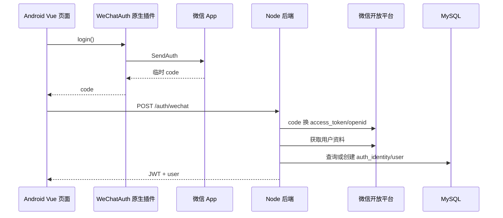
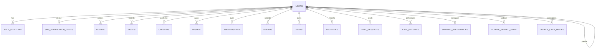
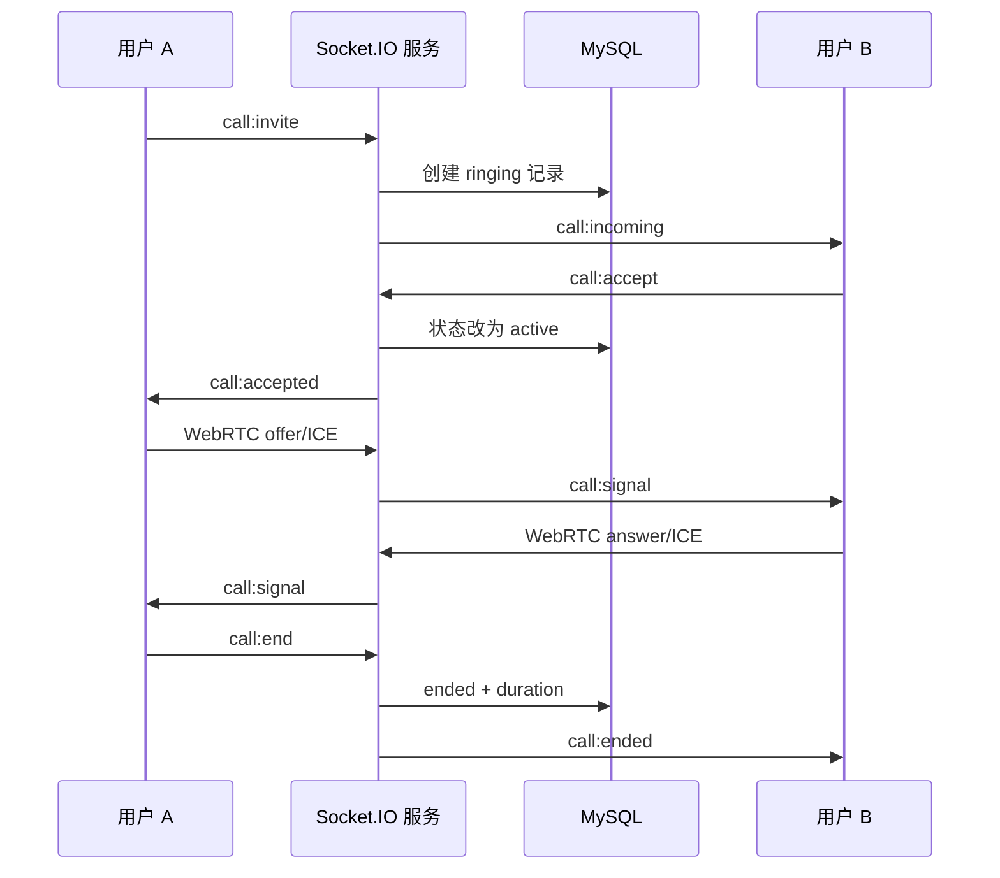
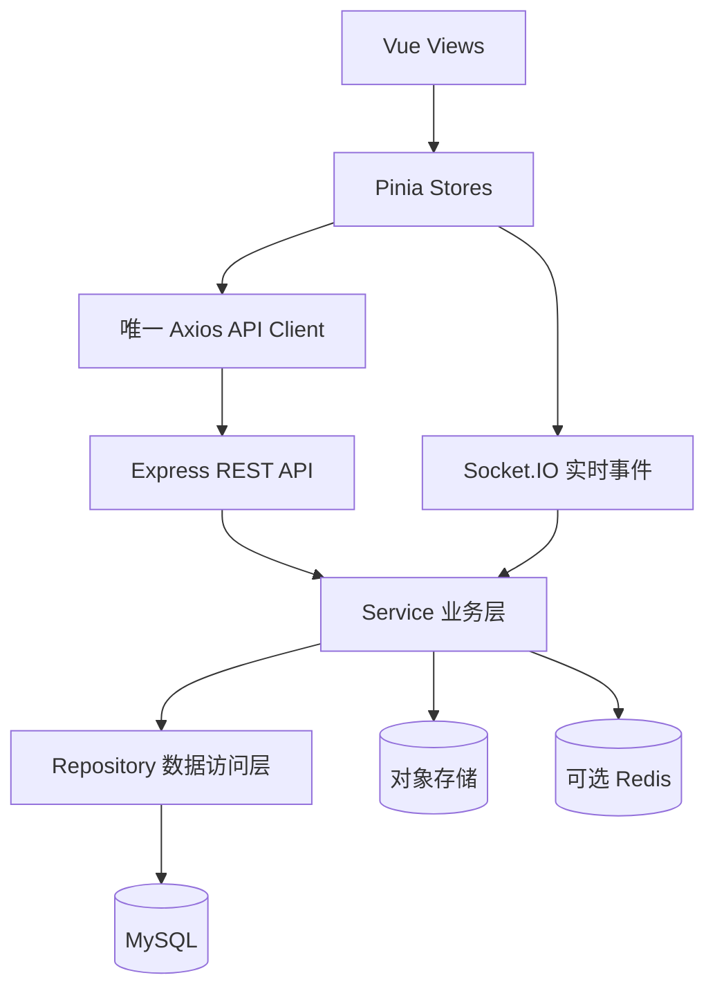

# 恋爱日记项目逻辑架构说明

## 1. 项目定位

“恋爱日记”是一个面向情侣双人使用的移动优先应用，目标是把情侣关系中的记录、互动、共享和陪伴功能集中到一个应用中。

项目目前同时支持三种运行形态：

1. 普通 Web 网站；
2. 可安装到手机桌面的 PWA；
3. 通过 Capacitor 打包的 Android App。

主要业务包括：

- 手机号、短信验证码和微信登录；
- 情侣邀请码绑定；
- 个人资料和情侣资料；
- 日记、心情、打卡；
- 纪念日、计划、愿望清单；
- 相册、情侣基金；
- 实时聊天；
- 语音或视频通话信令；
- 位置分享；
- 手机使用情况分享；
- 冷静模式；
- 闹钟提醒；
- 游戏、吐槽、主题设置和数据统计。

需要特别说明：当前项目不是所有页面都直接使用独立数据库表。它采用了“真实后端 + 本地存储 + 情侣共享 JSON 状态”并存的混合数据架构。

## 2. 项目目录边界

当前总目录：

```text
D:\qingfeng\ZIYAN\Love
├─ love-diary/                   # Git 仓库，前端、Android、后端源码均在其中
├─ love-diary-backend/           # 外层后端工作副本，不属于 Git 仓库
├─ start-all.bat
├─ start-backend.bat
└─ GitHub提交与更新操作手册.md
```

真正提交到 GitHub 的项目是：

```text
D:\qingfeng\ZIYAN\Love\love-diary
```

该仓库内部结构：

```text
love-diary/
├─ src/                          # Vue 3 主应用
│  ├─ api/                       # HTTP API、模拟 API、共享状态同步
│  ├─ config/                    # 应用静态配置
│  ├─ data/                      # localStorage 适配层和旧数据仓库
│  ├─ modules/                   # 较早期的原生 JavaScript 功能模块
│  ├─ native/                    # Web 与 Capacitor 原生插件的桥接
│  ├─ realtime/                  # Socket.IO 通话连接
│  ├─ router/                    # Vue Router 路由
│  ├─ stores/                    # Pinia 状态管理
│  ├─ utils/                     # 日期、存储工具
│  ├─ views/                     # 业务页面
│  ├─ App.vue                    # 根组件
│  └─ main.js                    # Vue 启动入口
├─ modules/                      # 旧模块样式
├─ assets/                       # 公共 CSS、图片和旧脚本
├─ public/                       # PWA manifest 和 Service Worker
├─ android/                      # Capacitor Android 原生工程
├─ backend/                      # Node.js 后端，随仓库提交
├─ .github/workflows/            # GitHub Pages 和 APK 自动构建
├─ capacitor.config.json
├─ vite.config.js
├─ package.json
└─ index.html
```

### 外层后端副本问题

以下两个目录的核心依赖相同：

```text
love-diary/backend
love-diary-backend
```

但检查结果显示，两者的 `server.js` 已经不同。这意味着它们不是完全一致的镜像。

当前推荐把 `love-diary/backend` 作为唯一正式源码，因为它已经进入 Git 版本管理。外层 `love-diary-backend` 如果继续独立修改，会产生：

- 修复只存在于其中一份；
- 本地运行版本和 GitHub 版本不一致；
- 部署时不知道应该使用哪份；
- 环境配置和数据库脚本逐渐分叉。

## 3. 总体技术架构



核心分层可以概括为：

```text
展示层 Vue Views
    ↓
状态层 Pinia / 页面内部响应式状态
    ↓
数据访问层 Axios API / MockAPI / localStorage
    ↓
共享同步层 couple_shared_state
    ↓
业务服务层 Express Controllers / Socket.IO
    ↓
持久化层 MySQL
```

## 4. 前端技术栈

| 技术 | 当前版本或配置 | 用途 |
|---|---:|---|
| Vue | 3.4.x | 页面和组件框架 |
| Vue Router | 4.3.x | 页面路由与登录拦截 |
| Pinia | 2.1.x | 用户、日记、心情、打卡状态管理 |
| Vite | 5.1.x | 开发服务器、构建和环境变量注入 |
| Axios | 1.6.x | REST API 请求 |
| Socket.IO Client | 4.8.x | 实时通话信令 |
| Capacitor | 8.4.x | Web 应用打包为 Android App |
| Capacitor Local Notifications | 8.2.x | Android 本地通知和闹钟 |
| Tailwind CSS | 3.4.x | 原子化 CSS 工具链 |
| PostCSS | 8.4.x | CSS 构建处理 |
| Autoprefixer | 10.4.x | 自动添加浏览器 CSS 前缀 |
| Service Worker | 原生实现 | PWA 缓存和离线访问 |
| localStorage | 浏览器原生 | 本地业务数据和会话缓存 |

### 前端启动流程

入口文件是 `src/main.js`：

```text
加载主题
→ createApp(App)
→ 注册 Pinia
→ 注册 Vue Router
→ 挂载到 #app
→ 生产环境注册 Service Worker
```

根组件 `src/App.vue` 的逻辑：

```text
显示当前路由页面
→ 页面切换使用淡入淡出动画
→ 初始化本地模拟数据
→ 从 localStorage 和后端恢复用户会话
```

开发环境会注销旧 Service Worker，避免开发时页面资源被旧 PWA 缓存覆盖。

## 5. 路由与页面架构

项目使用 Vue Router。

### 路由模式

- Android 原生构建：`createWebHashHistory()`；
- Web 和 GitHub Pages：`createWebHistory(import.meta.env.BASE_URL)`。

Android 使用 Hash 路由是为了避免 WebView 内部刷新页面时找不到服务器路径。

Web 构建的基础路径是：

```text
/RitaYY1129/
```

它与当前 GitHub Pages 仓库地址匹配。

### 登录守卫

除登录页外，业务页面都带有：

```js
meta: { requiresAuth: true }
```

路由守卫的判断：

```text
访问受保护页面
→ 检查 Pinia Auth Store 中是否同时存在 token 和 user
→ 未登录则跳转 /
→ 已登录访问 / 则跳转 /home
```

### 主要页面

| 路径 | 页面 | 业务作用 |
|---|---|---|
| `/` | Auth | 登录、注册、验证码、微信登录 |
| `/home` | Home | 情侣首页、聚合摘要和入口 |
| `/diary` | Diary | 情侣日记 |
| `/mood` | Mood | 心情记录 |
| `/checkin` | Checkin | 每日打卡 |
| `/photo` | Photo | 相册和照片分组 |
| `/anniversary` | Anniversary | 纪念日 |
| `/plan` | Plan | 共同计划 |
| `/bucketlist` | BucketList | 愿望清单 |
| `/me` | Me | 个人中心、邀请码和统计 |
| `/profile` | Profile | 个人资料维护 |
| `/settings` | Settings | 偏好、隐私、共享、导入导出 |
| `/guardian` | Guardian | 情侣守护和设备使用动态 |
| `/themes` | Themes | 主题配置 |
| `/alarm` | Alarm | 本地提醒和闹钟 |
| `/dashboard` | Dashboard | 数据汇总 |
| `/games` | Games | 情侣互动小游戏 |
| `/location` | Location | 位置功能 |
| `/chat` | Chat | 聊天、语音、视频、通话 |
| `/fund` | Fund | 情侣基金和账目 |
| `/vent` | Vent | 吐槽或情绪记录 |

`/wishes` 当前会重定向至 `/bucketlist`，说明 Wishes 是旧命名，BucketList 是当前主要入口。

## 6. 前端状态管理

项目没有把全部页面都放入 Pinia。目前主要 Store 有：

- `auth`：登录态、用户、伴侣和个人资料；
- `diary`：日记列表；
- `mood`：心情记录；
- `checkin`：打卡历史和连续天数。

其他页面多数使用 Vue 页面内部的 `ref`、`computed` 和 `onMounted` 管理状态。

### Auth Store

Auth Store 保存：

```text
token
user
isLoggedIn
```

会话同时写入：

```text
loveDiary_token
loveDiary_user
```

页面刷新后的恢复过程：



缓存用户数据用于快速恢复界面，后端 `/auth/profile` 用于校验 Token 并刷新真实资料。

### Axios 请求拦截

统一 Axios 实例会从 localStorage 读取 JWT：

```http
Authorization: Bearer <token>
```

当后端返回 HTTP 401 时：

```text
删除本地 token
→ 删除本地 user
→ 跳回登录页
```

API 根地址优先读取：

```text
VITE_API_BASE
```

没有配置时使用同源：

```text
/api
```

本地 Vite 开发服务器将 `/api` 和 `/socket.io` 代理到：

```text
http://localhost:3000
```

## 7. 当前数据架构：三种数据路径

这是理解项目最关键的部分。

### 7.1 第一类：真实业务表

后端已经为以下业务提供独立 REST API 和 MySQL 表：

- 用户；
- 第三方登录身份；
- 短信验证码；
- 情侣关系；
- 日记；
- 心情；
- 打卡；
- 愿望；
- 纪念日；
- 照片；
- 计划；
- 位置；
- 聊天；
- 通话记录；
- 冷静模式；
- 隐私共享配置。

但是“后端存在接口”不代表“当前页面一定调用了这个接口”。部分页面仍调用 MockAPI。

### 7.2 第二类：localStorage + MockAPI

日记、心情、打卡、计划、纪念日等页面目前主要先写入浏览器 localStorage。

典型流程：

```text
页面操作
→ Pinia Store 或页面逻辑
→ MockAPI
→ localStorage
```

例如日记使用：

```text
loveDiary_diaries
```

MockAPI 使用 `Date.now()` 生成本地 ID，并在本地数组上完成创建、修改和删除。

这类数据具备：

- 无后端时仍可使用；
- 操作响应快；
- 可以保存演示数据；

但也存在：

- 清理浏览器数据会丢失；
- 更换设备后默认看不到；
- 多端并发编辑容易覆盖；
- 数据结构没有数据库约束。

### 7.3 第三类：情侣共享 JSON 状态

项目增加了 `couple_shared_state` 表，将整个模块的数据作为 JSON 文本同步到后端。

典型流程：



同步使用的模块键包括：

- `diary`
- `mood`
- `checkin`
- `anniversary`
- `wishes`
- `plans`
- `photos`
- `fund`
- `device_activity`

读取时：

```text
先读取 localStorage
→ 请求后端情侣共享状态
→ 后端存在数据则覆盖本地状态
→ 后端没有数据则把本地状态作为初始共享数据上传
```

写入时：

```text
先修改本地数据
→ 异步调用 putSharedState
→ 将完整模块 JSON 上传到后端
```

这是一种“整块文档同步”方式，不是逐条记录同步。

优点：

- 可以快速让本地功能支持情侣共享；
- 不需要每个页面都重写独立 CRUD；
- 模块结构灵活。

缺点：

- 两台设备同时修改时可能最后写入者覆盖前者；
- 数据量变大后每次上传完整 JSON 成本较高；
- 难以按单条记录审计和恢复；
- `version` 字段目前更接近版本计数，不是完整的乐观锁冲突处理；
- 独立业务表与共享 JSON 可能形成两套事实来源。

## 8. 功能与实际数据源对照

| 功能 | 页面存在 | 独立后端 API | 当前主要数据来源 | 情侣共享 |
|---|---|---|---|---|
| 登录注册 | 是 | 是 | MySQL | 不适用 |
| 短信登录 | 是 | 是 | MySQL + 腾讯云短信 | 不适用 |
| 微信登录 | 是 | 是 | 微信开放平台 + MySQL | 不适用 |
| 情侣绑定 | 是 | 是 | `users.partner_id` | 是 |
| 个人资料 | 是 | 是 | `users/profile_data` | 伴侣资料可读取 |
| 日记 | 是 | 是 | 当前页面主要为 localStorage/MockAPI | JSON 同步 |
| 心情 | 是 | 是 | 当前 Store 主要为 localStorage/MockAPI | JSON 同步 |
| 打卡 | 是 | 是 | 当前 Store 主要为 localStorage/MockAPI | JSON 同步 |
| 愿望清单 | 是 | 是 | localStorage/MockAPI | JSON 同步 |
| 纪念日 | 是 | 是 | localStorage/MockAPI | JSON 同步 |
| 计划 | 是 | 是 | localStorage/MockAPI | JSON 同步 |
| 相册 | 是 | 是 | localStorage 中的相册结构 | JSON 同步 |
| 情侣基金 | 是 | 未发现已挂载的后端 finance 路由 | localStorage | JSON 同步 |
| 位置 | 是 | 是 | 浏览器定位 + 后端位置接口 | 受隐私配置控制 |
| 聊天 | 是 | 是 | MySQL `chat_messages` | 双方会话 |
| 通话记录 | 是 | 是 | MySQL `call_records` | 双方会话 |
| 通话信令 | 是 | Socket.IO | 内存事件 + 数据库状态 | 实时 |
| 冷静模式 | 有 API | 是 | MySQL `couple_calm_modes` | 双方确认 |
| 手机使用动态 | 是 | 共享状态 API | Android UsageStats | 可选择共享 |
| 闹钟 | 是 | 否 | localStorage + 本地通知 | 否 |
| 游戏 | 是 | 否 | localStorage/页面逻辑 | 主要本地 |
| 吐槽 | 是 | 否 | localStorage | 否 |
| 主题 | 是 | 否 | localStorage + CSS 变量 | 本机 |

特别注意：

- `src/api/finance.js` 存在，但后端 `server.js` 没有挂载 `/api/finance` 路由；
- `src/api/diary.js` 等真实 API 文件存在，但当前相应 Pinia Store 仍使用 `MockAPI`；
- 项目内存在新旧两套 API 文件和数据访问方式，说明代码处于从本地演示版向真实双人应用迁移的阶段。

## 9. 后端技术栈

| 技术 | 版本 | 用途 |
|---|---:|---|
| Node.js | 部署镜像使用 22 | JavaScript 服务运行时 |
| Express | 4.18.x | REST API |
| MySQL | 8.4 | 关系数据库 |
| mysql2/promise | 3.6.x | Promise 风格数据库访问 |
| JSON Web Token | 9.0.x | 登录令牌 |
| bcryptjs | 2.4.x | 密码哈希 |
| Socket.IO | 4.8.x | 通话邀请和 WebRTC 信令 |
| CORS | 2.8.x | 跨域来源控制 |
| dotenv | 16.3.x | 环境变量加载 |
| 腾讯云 SMS SDK | 4.1.x | 手机验证码 |
| Docker | Node 22 Alpine | 后端容器 |
| Docker Compose | MySQL + Backend + Caddy | 生产编排 |
| Caddy | 2 Alpine | HTTPS 和反向代理 |

### 后端启动流程

生产容器执行：

```text
node scripts/init-db.js
→ node scripts/migrate-mobile-auth.js
→ node server.js
```

含义：

1. 创建数据库和基础表；
2. 对旧数据库执行移动登录相关迁移；
3. 启动 Express 和 Socket.IO。

Express 默认监听：

```text
PORT=3000
```

请求体限制：

```text
8 MB
```

这一限制与聊天图片、语音、视频使用 Base64 内容有关。

## 10. 后端请求处理链路



鉴权中间件会：

1. 从 `Authorization` 请求头提取 Token；
2. 使用 `JWT_SECRET` 验证；
3. 从 `users` 表重新查询用户；
4. 把用户写入 `req.user`；
5. Token 无效或用户不存在时返回 401。

## 11. REST API 结构

后端在 `server.js` 中挂载：

```text
/api/auth
/api/diaries
/api/moods
/api/checkins
/api/wishes
/api/anniversaries
/api/photos
/api/plans
/api/locations
/api/calm-mode
/api/chat
/api/calls
/api/sharing
/api/health
```

### 认证接口

| 方法 | 路径 | 作用 |
|---|---|---|
| POST | `/api/auth/register` | 传统手机号密码注册 |
| POST | `/api/auth/login` | 密码登录 |
| POST | `/api/auth/sms/send` | 发送验证码 |
| POST | `/api/auth/sms/login` | 验证码登录 |
| POST | `/api/auth/sms/register` | 验证码注册 |
| POST | `/api/auth/wechat` | 微信授权登录 |
| GET | `/api/auth/profile` | 当前用户和伴侣资料 |
| PUT | `/api/auth/profile` | 更新资料 |
| POST | `/api/auth/partner/bind` | 邀请码或手机号绑定伴侣 |
| POST | `/api/auth/partner/unbind` | 解除绑定 |

### 内容接口

日记：

```text
GET    /api/diaries
GET    /api/diaries/:id
POST   /api/diaries
PUT    /api/diaries/:id
DELETE /api/diaries/:id
```

心情：

```text
GET  /api/moods
POST /api/moods
GET  /api/moods/stats
```

打卡：

```text
POST /api/checkins
GET  /api/checkins/history
GET  /api/checkins/stats
```

愿望和计划均支持：

```text
列表、创建、更新、删除、完成
```

纪念日、照片支持：

```text
列表、创建、更新、删除
```

位置支持：

```text
GET  /api/locations
POST /api/locations
GET  /api/locations/partner
GET  /api/locations/history
```

### 情侣互动接口

聊天：

```text
GET  /api/chat
POST /api/chat
```

通话记录：

```text
GET /api/calls
```

冷静模式：

```text
GET  /api/calm-mode
POST /api/calm-mode/request
POST /api/calm-mode/:id/accept
POST /api/calm-mode/:id/exit
```

共享：

```text
GET /api/sharing/preferences
PUT /api/sharing/preferences
GET /api/sharing/state/:module
PUT /api/sharing/state/:module
```

## 12. 登录与情侣绑定逻辑

### 密码登录

```text
手机号 + 密码
→ 根据手机号查询 users
→ bcrypt.compare 校验密码
→ JWT 签发 userId
→ 返回 token 和用户信息
→ 前端写入 localStorage
```

密码使用 bcrypt 进行哈希，工作因子为 10。

### 短信验证码

开发环境：

```text
SMS_PROVIDER=console
→ 验证码打印到后端控制台
→ 接口可将 devCode 返回前端
```

生产环境：

```text
SMS_PROVIDER=tencent
→ 腾讯云短信 SDK
→ 中国大陆手机号增加 +86
```

验证码不是明文存储，而是通过服务端 Secret 形成哈希后写入 `sms_verification_codes`。

表中还记录：

- 用途；
- 尝试次数；
- 过期时间；
- 是否已经使用；
- 创建时间。

### 微信登录



微信登录只在 Android 原生环境可用，网页端不会直接调用原生微信插件。

### 情侣绑定

每个用户拥有唯一 `invite_code`。

绑定时可以输入：

- 对方邀请码；
- 对方手机号。

后端通过事务和 `FOR UPDATE` 锁定双方用户，检查：

- 不能绑定自己；
- 当前用户不能已经绑定其他人；
- 对方不能已经绑定其他人。

成功后双向写入：

```text
A.partner_id = B.id
B.partner_id = A.id
```

因此当前模型是一对一情侣关系。

## 13. 数据库模型

### 核心关系



### 用户和身份

`users`：

- `id`
- `phone`
- `nickname`
- `avatar`
- `profile_data`
- `password_hash`
- `invite_code`
- `partner_id`
- 创建和更新时间

`profile_data` 是 JSON，当前允许的资料包括：

- 性别；
- 生日；
- 个性签名；
- 城市；
- 睡觉和起床时间；
- 沟通方式；
- 冲突处理方式；
- 约会偏好；
- 爱的语言；
- 兴趣爱好；
- 喜欢的食物；
- 不喜欢的事物。

`auth_identities` 用于将微信等第三方身份映射到用户：

- provider；
- provider_user_id；
- union_id；
- user_id。

### 情侣内容表

`diaries`：

- 标题；
- 内容；
- 所属用户；
- 创建和更新时间。

`moods`：

- 分数；
- 表情；
- 备注；
- 日期；
- 每个用户每天只能有一条。

`checkins`：

- 用户；
- 日期；
- 每个用户每天只能打卡一次。

`wishes` 和 `plans`：

- 标题；
- 描述；
- 目标日期；
- 是否完成；
- 完成时间。

`anniversaries`：

- 名称；
- 日期；
- 类型。

`photos`：

- URL；
- 标题；
- 描述。

目前照片并没有独立对象存储服务，前端部分场景使用 Base64 或本地数据，数据库字段只是 URL 字符串。

`locations`：

- 经纬度；
- 地址；
- 是否共享；
- 上报时间。

### 互动表

`chat_messages`：

- 发送者；
- 接收者；
- 消息类型；
- LONGTEXT 内容；
- JSON metadata；
- 已读时间。

支持的前端消息类型包括：

- 文本；
- 语音；
- 图片；
- 视频；
- 位置。

语音、图片或视频当前可能直接以 Data URL/Base64 放入 LONGTEXT。这适合内部测试，但不适合大规模生产使用。

`call_records`：

- 呼叫者；
- 接听者；
- voice/video；
- ringing/active/ended/rejected/missed/failed；
- 开始、接听和结束时间；
- 通话时长。

`couple_calm_modes`：

- 发起人；
- 对方；
- 接受人；
- pending/active/ended；
- 结束时间；
- 接受和退出时间。

### 共享数据表

`sharing_preferences` 控制不同模块是否允许共享：

- 纪念日；
- 愿望；
- 计划；
- 基金；
- 照片；
- 日记；
- 心情；
- 打卡；
- 位置；
- 手机使用动态。

`couple_shared_state` 使用以下唯一键：

```text
user_low_id + user_high_id + module_key
```

无论哪一方请求，双方 ID 都会排序，确保同一对情侣、同一个模块只有一份共享状态。

数据字段包括：

- 完整 JSON payload；
- 最后更新者；
- version；
- 更新时间。

## 14. 聊天和通话架构

### 聊天

聊天走 REST API，而不是 Socket.IO 实时消息推送：

```text
发送消息
→ POST /api/chat
→ 写入 chat_messages
→ 返回消息
```

```text
读取消息
→ GET /api/chat
→ 根据当前用户和 partner_id 查询会话
→ 返回消息列表
```

聊天页面还会把可序列化消息缓存到：

```text
loveDiary_chatMessages
```

该缓存用于界面快速恢复，不是聊天记录的主要权威来源。

### 音视频通话

项目当前实现的是 Socket.IO 信令层，并由浏览器 WebRTC API 完成媒体连接。

Socket.IO 事件：

```text
call:invite
call:incoming
call:accept
call:accepted
call:signal
call:reject
call:end
call:ended
```

通话流程：



Socket 连接同样使用 JWT 鉴权。每个用户加入：

```text
user:<userId>
```

房间，用于把来电和信令精准发送给伴侣。

当前代码没有看到专门部署的 TURN 服务配置。跨复杂 NAT、移动网络或某些运营商网络时，WebRTC 可能无法建立连接。生产级音视频通常还需要 STUN/TURN 配置和媒体失败处理。

## 15. Android 原生架构

Android 工程不是完全原生 UI 应用，而是：

```text
Vue 页面
→ Vite 构建 dist
→ Capacitor 同步到 Android
→ BridgeActivity WebView 运行
→ 必要功能通过 Capacitor Plugin 调用 Java
```

应用标识：

```text
com.ritayy.lovediary
```

### 原生能力

#### 本地通知和闹钟

使用 `@capacitor/local-notifications`：

- 申请通知权限；
- 申请精确闹钟权限；
- 创建不同声音的通知频道；
- 支持一次性提醒；
- 支持按星期重复；
- 关闭或删除闹钟时取消通知。

Web 端退化为浏览器 Notification + `setTimeout`。

Web 端的计时器在页面关闭后不能保证继续运行，因此真正可靠的闹钟能力主要在 Android App 中。

#### 手机使用情况

自定义 `DeviceActivityPlugin.java` 使用 Android：

```text
UsageStatsManager
UsageEvents
PACKAGE_USAGE_STATS
```

读取：

- 当天各 App 前台使用时长；
- 最近使用时间；
- App 名称和图标；
- 亮屏和熄屏事件；
- 总使用时长。

用户必须进入系统“使用情况访问权限”页面手动授权。

收集结果可以通过共享状态模块 `device_activity` 上传给伴侣，但需要用户开启对应共享偏好。

#### 微信授权

自定义 `WeChatAuthPlugin.java`：

- 检查微信是否安装；
- 调用微信 SDK；
- 使用随机 state 防止授权响应混淆；
- 接收 `WXEntryActivity` 回调；
- 把临时授权 code 交给 Vue；
- Vue 再将 code 发给后端。

微信 AppID 从 Android `local.properties` 注入到 `BuildConfig.WECHAT_APP_ID`。

### Android 权限

Manifest 当前声明：

- 网络；
- 精确闹钟；
-通知；
- 麦克风；
- 相机；
- 精确位置；
- App 使用情况统计。

这分别支撑：

- API 和 Socket 通信；
- 闹钟；
- 聊天通知；
- 语音和视频；
- 位置消息；
- 情侣守护功能。

### Android 安全注意点

当前配置允许：

```text
android:usesCleartextTraffic="true"
allowMixedContent=true
```

这是为了内网 HTTP 后端测试方便，但正式发布时会降低传输安全边界。生产版本应使用 HTTPS 后端，并考虑关闭明文流量和混合内容。

当前 GitHub Action 构建的是：

```text
assembleDebug
```

发布到 Releases 的也是内部测试 Debug APK，不是 Google Play 所需的正式签名 Release APK。

## 16. PWA 架构

项目包含：

- `public/manifest.webmanifest`
- `public/sw.js`
- 192×192 图标；
- 512×512 图标；
- Service Worker 注册逻辑。

生产环境构建后可以：

- 从浏览器安装到桌面；
- 以接近独立 App 的窗口打开；
- 缓存基础静态资源；
- 支持基础离线访问。

PWA 离线能力不等于全部业务离线可用。登录、聊天、共享同步和真实后端功能仍需要网络。

## 17. 构建与部署架构

### Web 开发

```powershell
npm install
npm run dev
```

Vite 默认运行在：

```text
http://localhost:5173
```

并代理后端：

```text
/api       → http://localhost:3000
/socket.io → http://localhost:3000
```

### Web 构建

```powershell
npm run build
```

产物进入：

```text
dist/
```

Vite 自定义插件会将 PWA 图标复制到：

```text
dist/assets/img/
```

### GitHub Pages

推送到 `main` 后触发：

```text
.github/workflows/deploy-pages.yml
```

流水线：

```text
Checkout
→ Node 20
→ npm ci
→ npm run build
→ 复制 index.html 为 404.html
→ 上传 Pages artifact
→ 部署 GitHub Pages
```

复制 `404.html` 是为了让单页应用在 GitHub Pages 中访问深层路由时能够回到 Vue 应用。

### Android APK

触发方式：

- 推送 `v*` 标签；
- GitHub Actions 手动运行。

流水线：

```text
Checkout
→ Node 22
→ Java 21
→ Android SDK
→ npm ci
→ npm run build:android
→ Vite Android 模式构建
→ cap sync android
→ Gradle assembleDebug
→ 重命名 APK
→ 创建 GitHub prerelease
```

Android 构建时注入：

```text
VITE_NATIVE_APP=true
VITE_API_BASE=<后端地址>
```

默认测试后端地址是一个局域网 IP。分享 APK 给外部用户前，必须替换为公网 HTTPS API。

### 后端生产部署

Docker Compose 启动三个服务：

```text
MySQL 8.4
Node.js Backend
Caddy
```

网络入口：

```text
用户
→ HTTPS 443
→ Caddy
→ backend:3000
→ MySQL
```

MySQL 不暴露公网端口。

Caddy 自动：

- 申请和续期 HTTPS 证书；
- gzip/zstd 压缩；
- 设置 HSTS；
- 禁止 MIME 嗅探；
- 禁止页面被 iframe 嵌入；
- 设置 Referrer Policy。

## 18. 环境变量

### 前端

| 变量 | 用途 |
|---|---|
| `VITE_API_BASE` | REST API 根地址，通常以 `/api` 结尾 |
| `VITE_SOCKET_URL` | 可选的 Socket.IO 服务地址 |
| `VITE_NATIVE_APP` | 是否使用 Android 原生路由模式 |

### 后端

| 变量 | 用途 |
|---|---|
| `NODE_ENV` | development/production |
| `PORT` | HTTP 端口 |
| `JWT_SECRET` | JWT 签名密钥 |
| `JWT_EXPIRES_IN` | Token 有效期 |
| `DB_HOST` | MySQL 地址 |
| `DB_PORT` | MySQL 端口 |
| `DB_USER` | 数据库用户 |
| `DB_PASSWORD` | 数据库密码 |
| `DB_NAME` | 数据库名 |
| `CORS_ORIGINS` | 允许的客户端来源 |
| `SMS_PROVIDER` | console/tencent |
| `SMS_CODE_SECRET` | 验证码哈希密钥 |
| `SMS_CODE_TTL_SECONDS` | 验证码有效期 |
| `TENCENT_SMS_*` | 腾讯云短信配置 |
| `WECHAT_APP_ID` | 微信移动应用 AppID |
| `WECHAT_APP_SECRET` | 微信 AppSecret |
| `API_DOMAIN` | Caddy 对外 API 域名 |

敏感环境变量不能提交到 Git。

## 19. 当前项目的优势

1. 已经形成 Web、PWA、Android 三端复用一套 Vue 代码的架构；
2. 登录、JWT、情侣绑定、聊天和通话有真实后端基础；
3. 数据库表覆盖了大多数核心业务；
4. 情侣共享状态机制让本地功能可以快速获得双人同步能力；
5. Android 有自定义微信登录和使用情况统计插件；
6. GitHub Actions 已打通 Web 自动部署和 APK 自动发布；
7. 后端具备 Docker Compose、MySQL 和自动 HTTPS 部署方案；
8. 数据库操作使用参数化查询，基础 SQL 注入风险较低；
9. 情侣绑定使用数据库事务，避免双方绑定关系被并发破坏；
10. 项目已经不是单纯静态 Demo，而是具备完整产品雏形。

## 20. 当前架构的主要问题和风险

### 20.1 数据源并存

同一个功能可能同时存在：

- 独立 REST API；
- MySQL 业务表；
- MockAPI；
- localStorage；
- `couple_shared_state` JSON。

开发者很容易误以为修改了后端接口，页面就会立即使用。实际上当前部分 Store 根本没有调用独立 API。

### 20.2 两份后端源码

仓库内外各有一份后端，并且已经发生文件差异。这是当前最高优先级的维护风险之一。

### 20.3 API 客户端重复

项目同时有：

```text
src/api/index.js
src/api/auth.js
src/api/diary.js
src/api/mood.js
...
```

它们重复创建 Axios 实例和拦截器。后续修改 Token 处理、超时或错误逻辑时，可能只改到其中一份。

### 20.4 新旧前端模块并存

项目同时存在：

- `src/views/*.vue`
- `src/modules/*`
- 根目录 `modules/*`
- `assets/js/*`

当前主应用以 Vue Views 为核心，其他目录更像旧版本或遗留实现。继续保留会增加理解和维护成本。

### 20.5 媒体存储方式不适合生产

头像、聊天图片、语音和视频可能使用 Base64 或 LONGTEXT：

- 请求体膨胀；
- MySQL 体积快速增长；
- 内存占用高；
- 8 MB 限制容易触发；
- CDN 和缓存能力不足。

正式版本应接入对象存储，将数据库中只保存文件 URL 和元数据。

### 20.6 共享状态有覆盖风险

完整 JSON 覆盖适合低频小数据，但两个人同时编辑时缺少真正的冲突合并。

### 20.7 Web 聊天不是真正实时

Socket.IO 当前主要用于通话信令。聊天发送和拉取使用 REST，没有看到聊天消息主动推送事件。若需要真正实时聊天，应增加消息 Socket 事件或可靠轮询策略。

### 20.8 WebRTC 基础设施不完整

缺少明确的 TURN 服务配置，跨网络通话成功率可能不稳定。

### 20.9 Debug APK

GitHub Release 当前发布 Debug APK：

- 没有正式签名流程；
- 不适合应用商店；
- 版本号仍固定；
- ProGuard 未启用；
- 明文网络仍允许。

### 20.10 安全与隐私

项目涉及：

- 精确位置；
- App 使用时长；
- 相机和麦克风；
- 情侣聊天；
- 头像和个人偏好。

这些属于高敏感数据。正式上线前需要：

- 明确授权说明；
- 隐私政策；
- 数据删除机制；
- 权限最小化；
- HTTPS 强制；
- 上传媒体访问控制；
- 登录和验证码限流；
- 操作审计；
- 数据备份与恢复。

### 20.11 测试不足

Android 中仍主要是 Capacitor 示例测试。前端和后端未看到系统性的单元测试、接口测试和端到端测试。

### 20.12 文本编码迹象

部分文件在当前终端读取时出现中文乱码。这可能是终端编码显示问题，也可能存在源码编码不统一。建议统一为 UTF-8，并通过编辑器和 CI 检查。

## 21. 推荐的目标架构

建议逐步收敛为：



理想职责：

- Vue Views：只负责展示和用户交互；
- Pinia：维护页面状态和调用用例；
- 单一 API Client：统一 Token、超时和错误；
- Express Router：路由和参数校验；
- Service：情侣关系、权限、同步等业务规则；
- Repository：集中 SQL；
- MySQL：结构化业务数据；
- 对象存储：图片、语音和视频；
- Socket.IO：实时聊天、在线状态、通话信令；
- localStorage：只做缓存和离线草稿，不作为主要数据库。

## 22. 推荐演进顺序

### 第一阶段：统一项目边界

1. 确定 `love-diary/backend` 是唯一后端；
2. 比较并合并外层后端的有效修改；
3. 停止同时维护两份代码；
4. 标记或删除确认无用的旧模块。

### 第二阶段：统一前端 API

1. 只保留一个 Axios 实例；
2. 将所有模块 API 从统一客户端导出；
3. 统一错误格式；
4. 增加请求取消、重试和登录过期处理。

### 第三阶段：统一数据来源

按业务逐个将 MockAPI 切换为真实 API：

```text
日记
→ 心情
→ 打卡
→ 纪念日
→ 愿望
→ 计划
→ 相册
→ 基金
```

每完成一个模块：

- 独立表成为权威数据源；
- localStorage 只保留缓存；
- 设计旧本地数据迁移；
- 删除该模块的 MockAPI 路径；
- 增加接口测试。

### 第四阶段：实时和媒体

1. 聊天增加 Socket.IO 实时消息；
2. 增加已读状态和在线状态；
3. 图片、语音、视频迁移到对象存储；
4. 配置 STUN/TURN；
5. 增加通话失败和弱网处理。

### 第五阶段：生产安全

1. 关闭 Android 明文网络；
2. 正式 APK 签名；
3. 密钥进入 GitHub Secrets 或服务器 Secret；
4. 增加验证码和登录限流；
5. 增加输入校验；
6. 增加隐私政策、注销和数据删除；
7. 配置数据库备份；
8. 增加日志、监控和告警。

## 23. 一次完整业务操作示例

以用户新增一篇日记为例，当前实际路径更接近：

```text
用户进入 /diary
→ Vue Router 校验登录
→ Diary.vue 调用 Diary Pinia Store
→ Store 调用 MockAPI.diary.create
→ 数据写入 loveDiary_diaries
→ Store 更新响应式 entries
→ 页面立即刷新
→ Store 异步调用 pushSharedState('diary')
→ Axios 添加 JWT
→ PUT /api/sharing/state/diary
→ 后端校验用户和情侣关系
→ 检查日记共享权限
→ 完整日记数组写入 couple_shared_state
→ 伴侣下次打开日记页时 hydrateSharedState
→ 下载共享数组并覆盖其本地缓存
```

这条链路并没有直接写入 `diaries` 表，虽然后端存在日记 CRUD API。

以发送聊天消息为例：

```text
用户进入 /chat
→ 输入文本、图片、语音、视频或位置
→ Chat.vue 调用 ChatAPI.send
→ POST /api/chat
→ JWT 中间件查询当前用户
→ Controller 检查是否绑定伴侣
→ 写入 chat_messages
→ 返回消息
→ 页面更新消息列表
→ 同时缓存到 localStorage
```

以发起视频通话为例：

```text
Chat.vue 获取 Socket.IO 单例
→ Socket 携带 JWT 连接
→ 发出 call:invite
→ 后端检查情侣关系和是否已有通话
→ 写入 call_records
→ 向伴侣 user 房间发送 call:incoming
→ 对方接受
→ 双方通过 call:signal 交换 WebRTC 信息
→ 浏览器建立点对点媒体连接
→ 结束时后端记录通话状态和时长
```

## 24. 架构结论

这个项目当前属于一个“功能完整度较高、架构仍在收敛中的全栈情侣应用”。

它已经具备：

- Vue 3 移动端界面；
- PWA；
- Capacitor Android；
- Node.js REST 后端；
- MySQL 数据库；
- JWT 登录；
- 短信和微信认证；
- 情侣关系；
- 共享状态；
- 聊天；
- WebRTC 通话信令；
- Android 原生权限和设备使用情况；
- GitHub 自动部署；
- Docker HTTPS 后端部署。

但它目前最重要的架构特征是：

```text
页面功能已经很多
≠
所有页面都已经使用独立后端数据库
```

当前真实情况是：

```text
核心身份与互动功能使用真实后端
+
大量内容功能使用 localStorage
+
部分内容通过共享 JSON 状态实现情侣同步
+
独立 CRUD API 和数据库表已经预先存在
```

后续开发的核心方向不是继续增加更多页面，而是把已有功能的数据源、后端副本、API 客户端和部署标准逐步统一。完成这些收敛后，项目才会从“可运行的完整产品原型”升级为“可稳定长期维护和正式上线的应用”。
